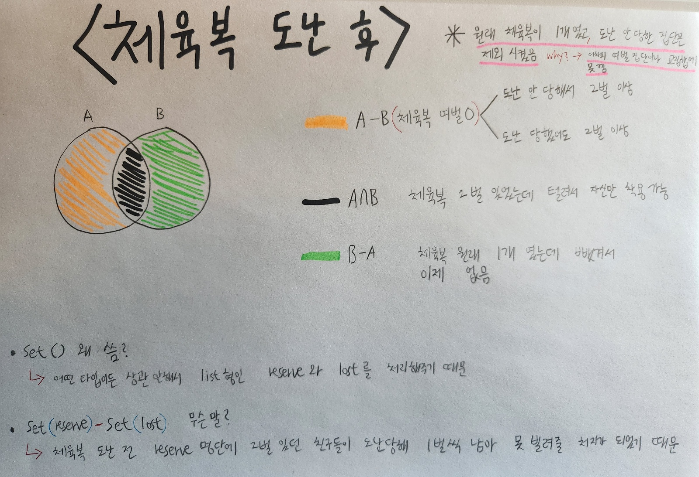

# [🔨프로그래머스 체육복(python)](https://school.programmers.co.kr/learn/courses/30/lessons/42862)


<br>
<br>
<br>
# 풀이 시작


<br>
<br>

```py
def solution(n, lost, reserve): 
    
    set_reserve = set(reserve)-set(lost)  # 여벌이 있으면서 도난 안 당한 학생들
    set_lost = set(lost)-set(reserve)   # 여벌도 없는데 체육복 털려서 체육복이 필요한 학생
    
    for i in set_reserve: # 여분 체육복으로 반복문
      # 체육복이 필요한데 체육복이 있다면, 진짜 체육복이 필요한 학생은 i-1, i+1

        if i-1 in set_lost: 
            set_lost.remove(i-1) 
				# 현재 학생의 번호보다 하나 적은 번호를 가진 학생이 '도난당한 학생 목록'에 있다면 그 학생에게 체육복 빌려줌 
				# 체육복을 빌려주니까 이제 set_lost에 있을 필요가 없어서 remove함
            
        elif i+1 in set_lost: 
            set_lost.remove(i+1) 
				# 현재 학생의 번호보다 하나 많은 번호를 가진 학생이 그 리스트에 있다면 그 학생에게 체육복 빌려줌
				# 위랑 마찬가지

    return n - len(set_lost)
		# 전체 - 체육복 잃어버린 학생들 == 체육 수업 들을 수 있는 학생들
```