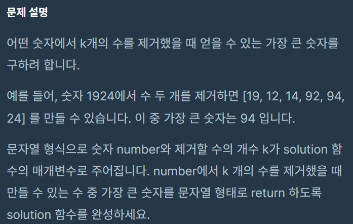
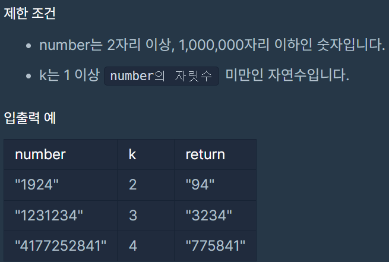
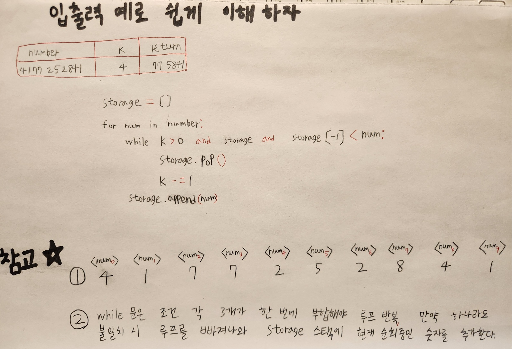
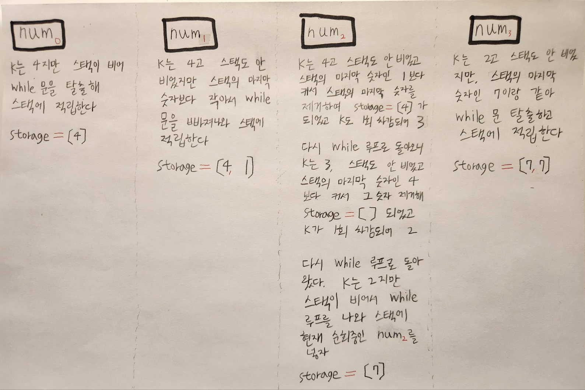
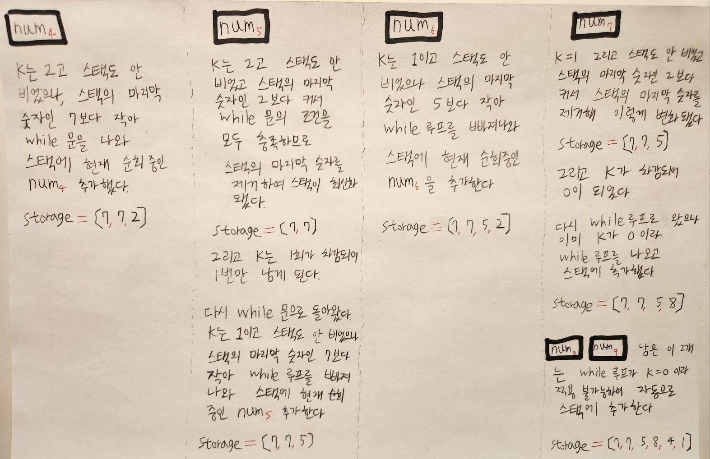

# [🔨프로그래머스 큰 수 만들기(python)](https://school.programmers.co.kr/learn/courses/30/lessons/42883)



<br>
<br>
<br>
<br>
<br>

# 풀이 시작
<br>

```py
def solution(number, k):
    storage = [] # Stack
    
    for num in number:
        while k > 0 and storage and storage[-1] < num:
            storage.pop()
            k -= 1
        storage.append(num)
        
    return ''.join(storage[:len(storage) - k])
						# 괄호 안에 든 것을 문자열로 결합
```



