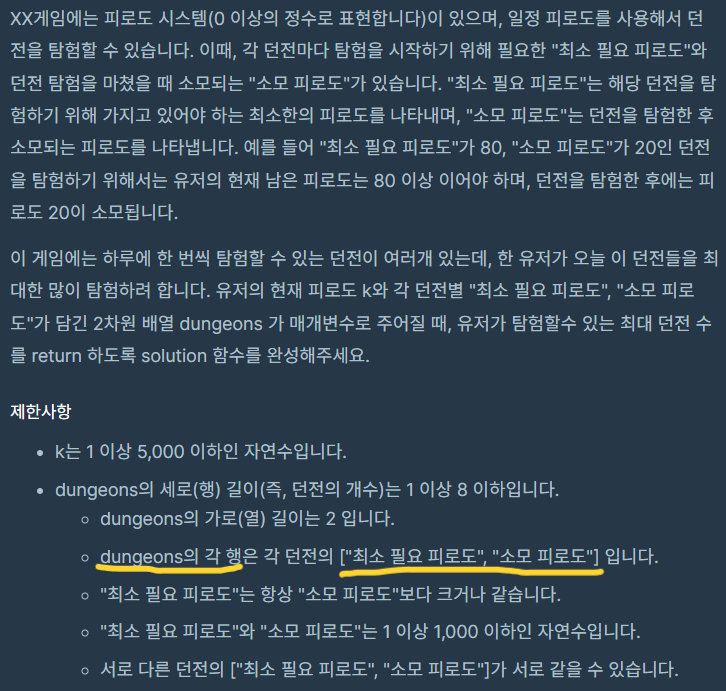
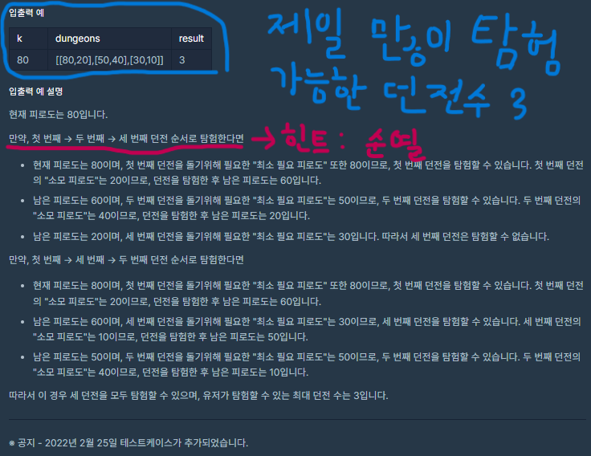
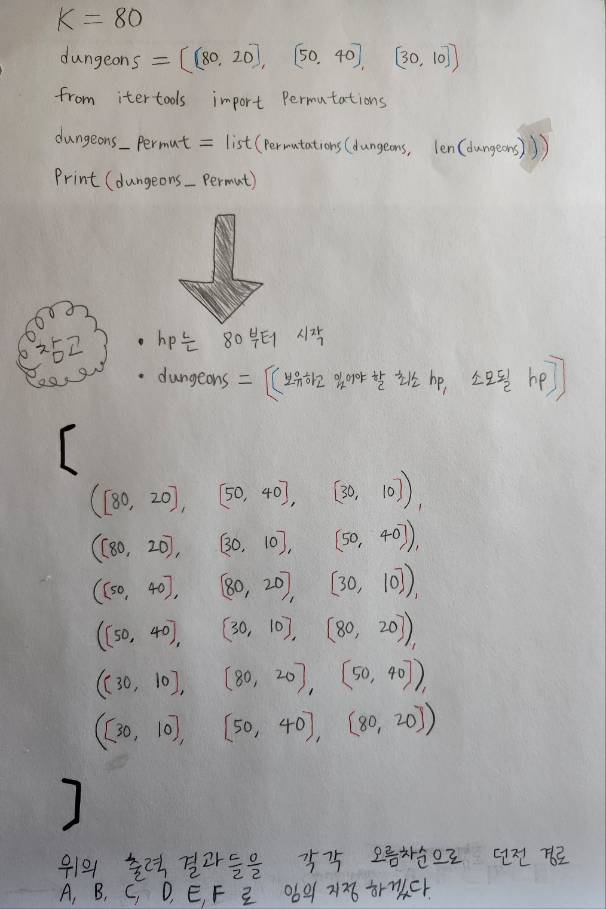
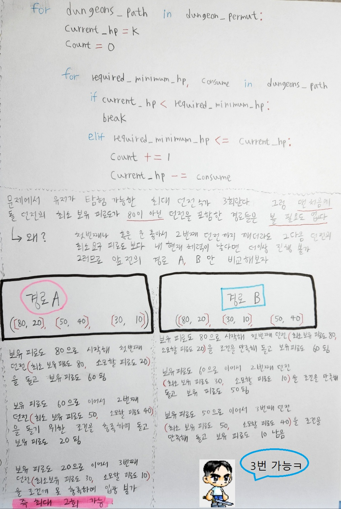

# [🔨프로그래머스 피로도(python)](https://school.programmers.co.kr/learn/courses/30/lessons/87946)



<br>
<br>
<br>
# 풀이 시작

<br>
<br>

```py
from itertools import permutations
def solution(k, dungeons):
    max_count = 0 
    dungeon_permut = list(permutations(dungeons, len(dungeons))) 
    
    for dungeons_path in dungeon_permut:
        current_hp = k    
        count = 0 
        
        for required_minimum_hp, consume in dungeons_path:
            if current_hp < required_minimum_hp:
                break 
            elif required_minimum_hp <= current_hp:
                count += 1    
                current_hp -= consume            
            
        if max_count < count:
            max_count = count
    
    return max_count
```
<br>
<br>


