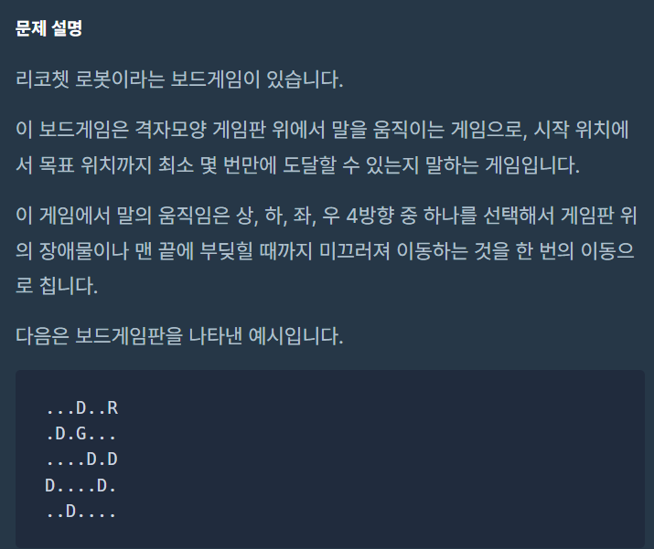
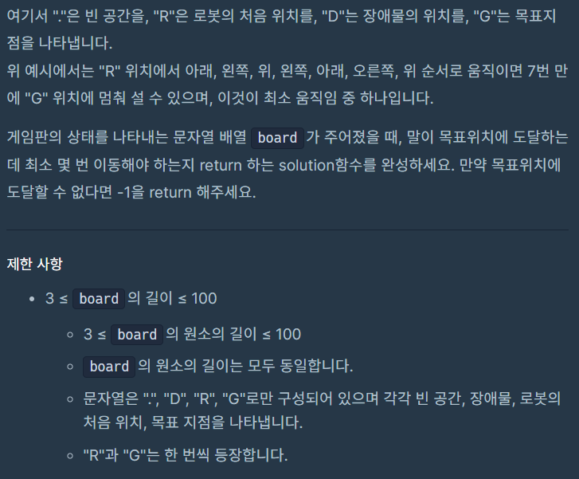
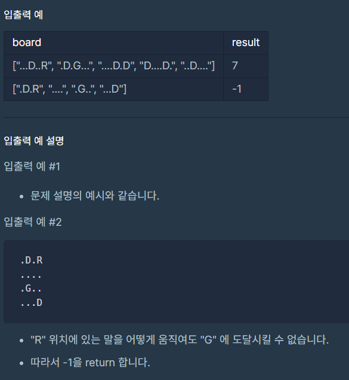
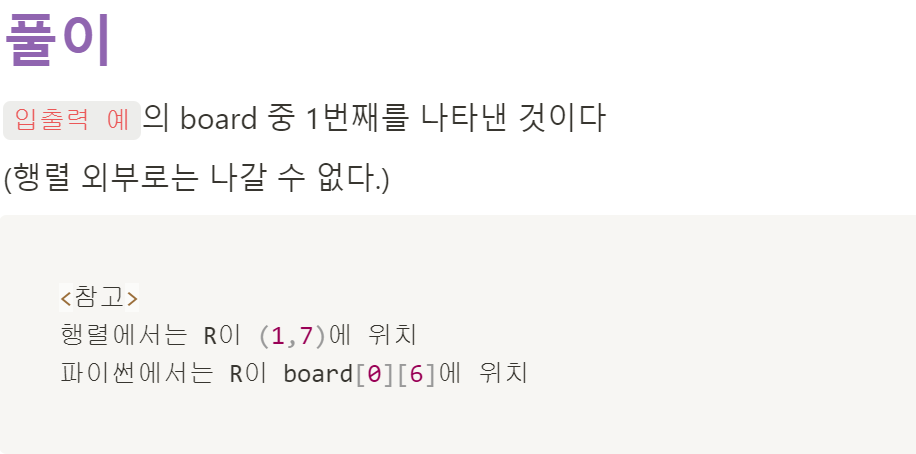
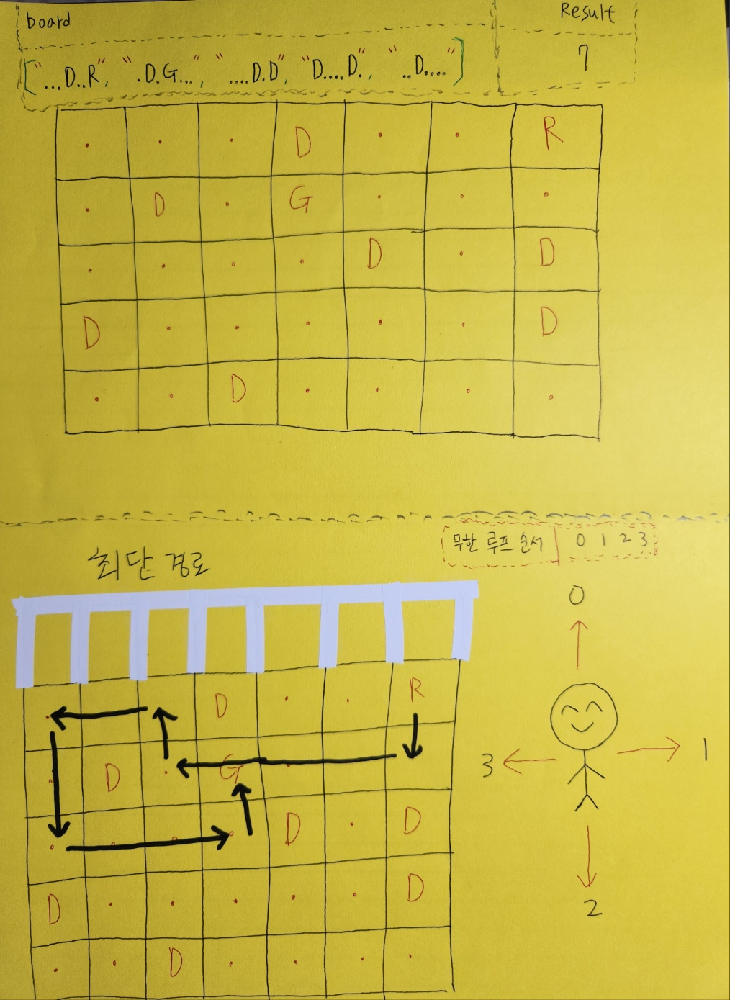
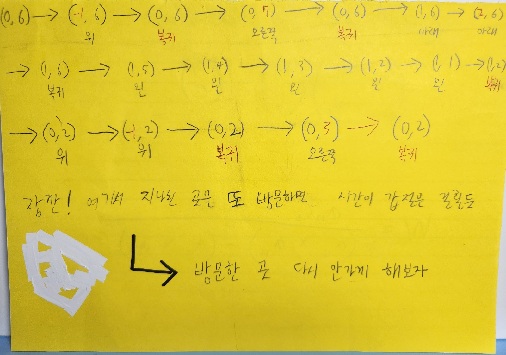
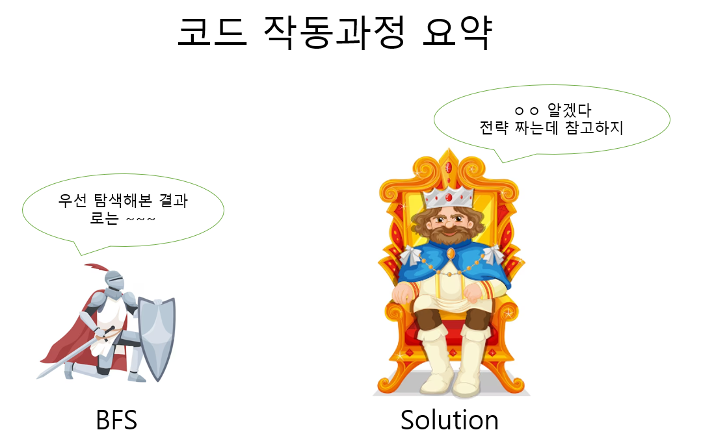
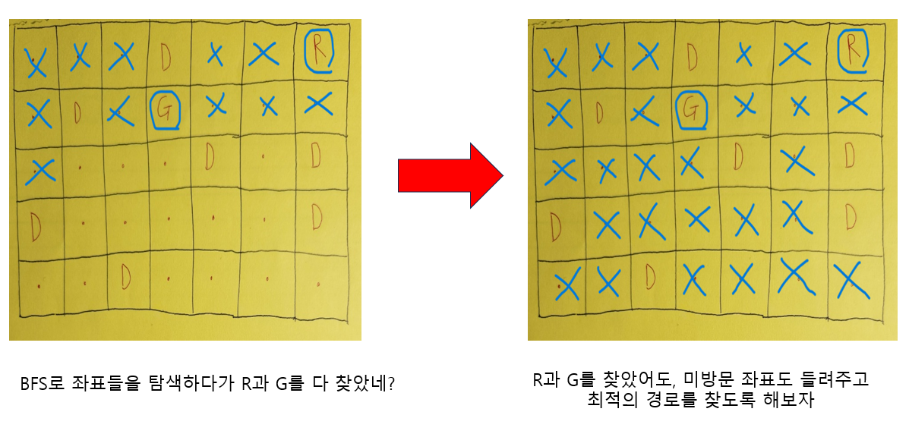

# [🔨프로그래머스 - 리코쳇 로봇(python)](https://school.programmers.co.kr/learn/courses/30/lessons/169199#)




<br>



<br>

# <span style="color:lime;">5x7 행렬</span>

<br>
<br>
<br>



<br>
<br>

```py
from collections import deque

def move(board, r, c, direction):
    # 0: up
    # 1: right
    # 2: down
    # 3: left
    if direction == 0:
        while r >= 0 and board[r][c] != 'D':
            r -= 1
        r += 1
    elif direction == 1:
        while c < len(board[0]) and board[r][c] != 'D':
            c += 1
        c -= 1
    elif direction == 2:
        while r < len(board) and board[r][c] != 'D':
            r += 1
        r -= 1
    else:
        while c >= 0 and board[r][c] != 'D':
            c -= 1
        c += 1

    return r, c

def bfs(board, r, c, goal_r, goal_c):
    q = deque()
    visited = set()

    q.append((r, c, 0)) # 첫 시작지점으로 행과 열, 움직인 횟수0 
    visited.add((r, c))
    while len(q) > 0:
        r, c, m = q.popleft()
        if r == goal_r and c == goal_c:
            return m # 목표 위치에 도달하면 m(움직인 횟수) 반환

        for direction in [0, 1, 2, 3]:
            new_r, new_c = move(board, r, c, direction)
            if (new_r, new_c) not in visited: # 새로운 지점에 방문 안했으면
                q.append((new_r, new_c, m + 1)) # 큐에 추가(현재까지 움직인 횟수 +1 하여)
                visited.add((new_r, new_c))

    return -1 # 목표 위치에 도달 못하면 -1 반환

def solution(board):
    # 2차원 board에서 0~4행을 탐삭해 문자 'R'이 나오는 위치 찾으면 종료
    found = False
    for r, row in enumerate(board): # r 인덱스     row 해당 행
        for c, char in enumerate(row): # c 인덱스    char 해당 문자
            if char == 'R':
                found = True
                break
        if found:
            break

    # 2차원 board에서 0~4행을 탐색해 문자 'G'이 나오는 위치 찾으면 종료
    found = False
    for goal_r, row in enumerate(board):
        for goal_c, char in enumerate(row):
            if char == 'G':
                found = True
                break
        if found:
            break

    print(r, c, goal_r, goal_c)
    answer = bfs(board, r, c, goal_r, goal_c)
    return answer
```
<br>
<br>


# ⚡참고

```py
# 'R'을 찾아보자

board = ["...D..R",
         ".D.G...",
         "....D.D",
         "D....D.",
         "..D...."]


for r, row in enumerate(board):
# => r:0,  row: [...D..R]
# => r:1,  row: [.D.G...]
# => r:2,  row: [....D.D]
# => r:3,  row: [D....D.]
# => r:4,  row: [..D....]

for c, char in enumerate(row):
# => [...D..R]
# c: 인덱스 0~6    char[0]~[6]: 각row 별 문자  

# => [.D.G...]
# c: 인덱스 0~6    char[0]~[6]: 각row 별 문자 

이런식으로 r4까지 반복
```