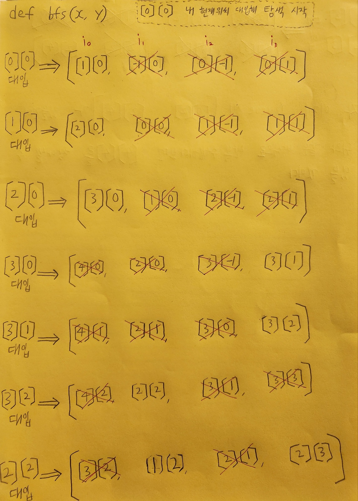

# [🔨프로그래머스 - 게임 맵 최단거리(python)](https://school.programmers.co.kr/learn/courses/30/lessons/1844)

# <span style="color:lime;">**참고**</span>
```py
pack = [[30,31,32,33,34]
       ,[35,36,37,38,39]
       ,[11,12,13,14,15]
       ,[16,17,18,19,20]
       ,[21,22,23,24,25]]


p = (pack[2][4])
p
# 15

p = (pack[0])
p
# [30,31,32,33,34]

p = (pack[3])
p
# [16,17,18,19,20]
```
<br><br>

### <span style="color:violet;">**내 현재 위치에서 적진까지 가는 최단거리 구해라**</span>
```
0: 막힌 통로
1: 지나갈 수 있는 길

case1: 갈 수 있다면 최단거리 반환
case2: 방벽에 의해 막혀서 못 간다면 -1 반환

* map 대신 path 입력했음
```
<br>


```py
from collections import deque

def solution(path):
    # 행,열 길이 정리
    total_row = len(path)
    total_col = len(path[0]) 
    
    # BFS 함수
    def bfs(x,y):
        # 큐 생성 후 초기값 추가
        q = deque()
        q.append([x, y])        
        while q:
            # x(행),y(열) 좌표 받기
            r, c = q.popleft()

            # 방향설정 --> 벡터(상,하,좌,우)
            dr = [1,-1,0,0] # 상하
            dc = [0,0,-1,1] # 좌우

            # 방향 이동
            for i in range(4): # i -> 0, 1, 2, 3
                nr = r + dr[i] # 상하 이동
                nc = c + dc[i] # 좌우 이동

                # 만약 하나의 continue에라도 해당하면 바로 다음번호 인덱스로 넘어가서 반복문 실행
                if nr < 0 or nc < 0 or nr >= total_row or nc >= total_col: 
                    continue
                # 방벽이면 지금 순회중인 i 빠져나와 다음 i 수행
                if path[r][c] == 0: 
                    continue
                # 방문한 적이 없는 경우에만
                if path[nr][nc] == 1:
                    # 이전 좌표값 +1
										# 여기서 1은 최단거리 반환을 위한 숫자를 세는 거라 path값엔 영향 없다
                    path[nr][nc] = path[r][c] + 1
                    # 큐에 새로 추가
                    q.append([nr, nc])
        
        # 상대 진영에 방벽이 구축되어 못 갈 경우
        if path[total_row-1][total_col-1] == 1: return -1
        # 상대 진영(빨간 5각형)에 방문했다면 기록 반환
        # from collections import deque

def solution(path):
    # 행,열 길이 정리
    total_row = len(path)
    total_col = len(path[0]) 
    
    # BFS 함수
    def bfs(x,y):
        # 큐 생성 후 초기값 추가
        q = deque()
        q.append([x, y])        
        while q:
            # x(행),y(열) 좌표 받기
            r, c = q.popleft()

            # 방향설정 --> 벡터(상,하,좌,우)
            dr = [1,-1,0,0] # 상하
            dc = [0,0,-1,1] # 좌우

            # 방향 이동
            for i in range(4): # i -> 0, 1, 2, 3
                nr = r + dr[i] # 상하 이동
                nc = c + dc[i] # 좌우 이동

                # 만약 하나의 continue에라도 해당하면 바로 다음번호 인덱스로 넘어가서 반복문 실행
                if nr < 0 or nc < 0 or nr >= total_row or nc >= total_col: 
                    continue
                # 방벽이면 지금 순회중인 i 빠져나와 다음 i 수행
                if path[r][c] == 0: 
                    continue
                # 방문한 적이 없는 경우에만
                if path[nr][nc] == 1:
                    # 이전 좌표값 +1
										# 여기서 1은 최단거리 반환을 위한 숫자를 세는 거라 path값엔 영향 없다
                    path[nr][nc] = path[r][c] + 1
                    # 큐에 새로 추가
                    q.append([nr, nc])
        
        # 상대 진영에 방벽이 구축되어 못 갈 경우
        if path[total_row-1][total_col-1] == 1: return -1
        # 상대 진영(빨간 5각형)에 방문했다면 기록 반환
        # 도착했으니 전체행렬에 각각 -1 차감한 것이다
        else: return path[total_row-1][total_col-1]
    
    lets_go = bfs(0,0)
    return lets_go
        else: return path[total_row-1][total_col-1]
    
    lets_go = bfs(0,0)
    return lets_go
```
<br>



